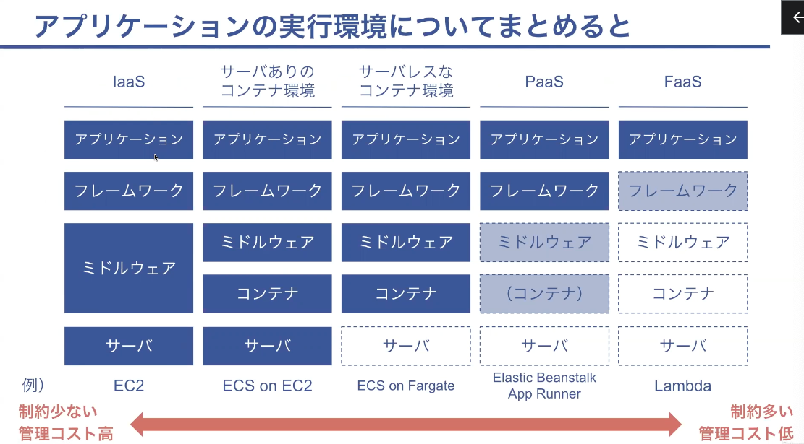
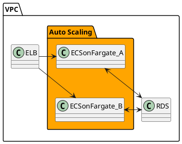
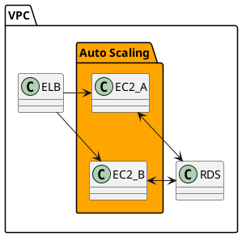
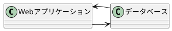
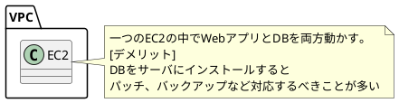
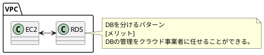
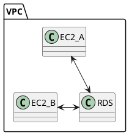
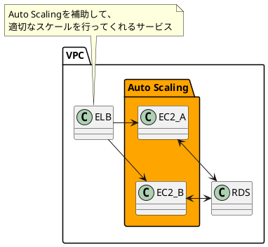

# AWSの使い方を学ぶ

## AWSについて
以下のような様々なサービスを提供している
- `IaaS`(Infrastructure as a Service)  
- `PaaS`(Platform as a Service)
- `FaaS`(Function as a Service)

### AWSの操作方法
- マネジメントコンソール
- AWS CLI
- ツール
- SDK

### AWSでアプリケーションの実行環境
#### 概要
- 実行環境の例
    - サーバ:EC2
    - コンテナ:ECS
    - Lambda

コンテナはサーバーの中で動く。  
サーバレスでの構築もできる。

#### 典型的なWebアプリケーションの構成例
- 講座の最終目標:EC on Fargateを複数とRDSを使う(Auto Scaling)

- 参考:★EC2を複数とRDSを使う(Auto Scaling)★

##### その他の構成
- 前提:Webアプリケーションの構成

- AWS:EC2一つの場合

- AWS:EC2とRDSを使う

- AWS:EC2を複数とRDSを使う

- ★AWS:EC2を複数とRDSを使う(Auto Scaling)★

- ★AWS:EC2を複数とRDSを使う(Auto Scaling)★

### AWSの料金体系
- [料金説明](https://aws.amazon.com/jp/pricing/?aws-products-pricing.sort-by=item.additionalFields.productNameLowercase&aws-products-pricing.sort-order=asc&awsf.Free%20Tier%20Type=*all&awsf.tech-category=*all)
- [無料枠](https://aws.amazon.com/jp/free/?all-free-tier.sort-by=item.additionalFields.SortRank&all-free-tier.sort-order=asc&awsf.Free%20Tier%20Types=*all&awsf.Free%20Tier%20Categories=*all)

## クラウドの定義
### 定義
クラウドコンピューティングは、共用の構成可能なコンピューティングリソース（ネットワーク、サー
バー、ストレージ、アプリケーション、サービス）の集積に、どこからでも、簡便に、必要に応じて、ネ
ットワーク経由でアクセスすることを可能とするモデルであり、最小限の利用手続きまたはサービス
プロバイダとのやりとりで速やかに割当てられ提供されるものである。このクラウドモデルは 5 つの
基本的な特徴と 3 つのサービスモデル、および 4 つの実装モデルによって構成される。
- オンデマンド・セルフサービス
- 幅広いネットワークアクセス
- リソースの共用
- スピーディな拡張性
- サービスが計測可能であること

### 参考資料
- [NISTの定義](https://www.ipa.go.jp/files/000025366.pdf)

## 1. VPCの作成
### 手順
- VPCの作成
    - `お使いのVPC -> VPCを作成 -> 以下の設定でVPCを作成` をクリック
        - VPCで料金はかからない
- RDSの作成
    - RDSのページに行く
    - 左のメニューから `サブネットグループ-> DBサブネットグループ を作成` を選択してサブネットグループを作成する
        - サブネットは各AZのプライベートサブネットを選択する。
    - 左のメニューから`データベース -> データベースの作成` を選択してデータベースを作成する。

- インスタンスとストレージは異なる料金が取られて
    - RDSを停止してもストレージの料金はかかる
        - ストレージに保存している内容はそのまま
    - RDSは停止してもインスタンスを7日後に自動で再起動する
        - 長期間使わないRDSのインスタンスは削除してしまっても良い

### VPCとは
`Virtural Private Cloud`のことAWS内の仮想ネットワーク環境

### VPCの仕組み
- リージョンとは
AWSのデータセンターがある地域を「リージョン」と呼ぶ  
- アベイラビリティゾーンとは
Availability Zoneはリージョンの中で電力やネットワークが独立している単位

- VPCはリージョン内に構築できる
    - アベイラビリティゾーンをまたがって構築できる。
        - 停電やネットワーク障害に強い環境にするため複数のAZにまたがるシステムが良い
- サブネットとはVPCを構成する単位
    - Public Subnet: インターネットから直接接続する必要がある部分
    - Private Subnet: インターネットから直接接続させたくない部分
- サブネットは `AZ` の単位で作成する必要がある。
    - AZ同士が通信するため？

### RDS
`Relational Database Service` のこと

## 2. コンテナの作成
### 手順
1. イメージをAWS Cloud9環境で作成する
    - `Cloud9 -> Create Environment` で環境を構築する
    - サーバのインスタンスが必要になる
    - Timeoutの設定でWebブラウザを閉じてから停止するまでの時間
    - `Cloud9` も停止してもストレージの料金がかかる
2. コンテナレジストリ( `ESR` )にイメージをPushする
    - `ECS -> リポジトリ -> リポジトリの作成` でDocker ImageをPushした
    - `リポジトリを選択 -> プッシュコマンドの表示` の指示に従ってDocker ImageをPushした
3. AWSのサーバ( `ES2` )でイメージをダウンロードしてコンテナを起動する

### AWS Cloud9とは
AWSが提供しているWebブラウザ上でコード実装できるサービス

## 教材
- [AWSコンテナサービス入門-AWSの基本からECS・Copilot・CI/CD・App Runnerまで](https://www.udemy.com/course/aws-container/learn/lecture/35553834?start=0#overview)
