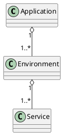
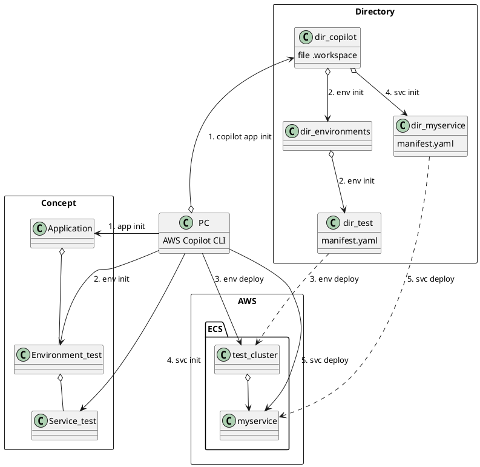

# AWS Copilotの使い方

- `AWS CLI` とは別物
- `ECS on Fargate` のサービス用のCLI

## 基本的な概念



## IAMの設定

- ローカル環境で実行する
    - `AWS Copilot CLI` のインストール
        - [公式ドキュメント](https://aws.github.io/copilot-cli/ja/)

    - `IAM User` を作成する。
    - `AWS CLI` の `Configure` で登録する。
    - `IAM User` に [AdministratorAccess](https://us-east-1.console.aws.amazon.com/iamv2/home?region=ap-northeast-1#/policies/details/arn%3Aaws%3Aiam%3A%3Aaws%3Apolicy%2FAdministratorAccess?section=policy_permissions)の権限を付与する

## ECS on Fargateの環境構築



### 使用するコマンド

- `copilot app init` : Applicationの初期化
- `copilot app show` : Applicationの情報を表示する
- `copilot env init` : Environmentの初期化
- `copilot env show` : Environmentの情報を表示する
- `copilot env deploy` : Environmentに対応するクラスタなどの作成
- `copilot svc init` : Serviceの初期化
- `copilot svc show` : Serviceの情報を表示する
- `copilot svc deploy` : Serviceのデプロイ
- 実際の操作

    1. `copilot app init`

        ```bash
        ❯ copilot app init
        Application name: udemy-aws-container
        ✔ Proposing infrastructure changes for stack udemy-aws-container-infrastructure-roles
        - Creating the infrastructure for stack udemy-aws-container-infrastructure-roles                [create complete]  [105.8s]
        - A StackSet admin role assumed by CloudFormation to manage regional stacks                   [create complete]  [51.6s]
        - An IAM role assumed by the admin role to create ECR repositories, KMS keys, and S3 buckets  [create complete]  [48.5s]
        ✔ The directory copilot will hold service manifests for application udemy-aws-container.

        Recommended follow-up action:
        - Run `copilot init` to add a new service or job to your application.

        # Applicationの情報を表示
        # まだ、Environmentが作成されていない
        ❯ copilot app show
        About

        Name                  udemy-aws-container
        Version               v1.2.0 
        URI                   N/A
        Permissions Boundary  N/A

        Environments

        Name    AccountID  Region
        ----    ---------  ------

        Workloads

        Name    Type      Environments
        ----    ----      ------------

        Pipelines

        Name
        ----
        ```

    2. `copilot app init`

        ```bash
        ❯ copilot env init
        Environment name: test
        Credential source: [profile default]
        Default environment configuration? No, I'd like to import existing resources
        VPC: vpc-013094c5444d46b02
        Public subnets: subnet-0574dd035b6fa7b2b, subnet-0cb8bcf6a40e2df4e, subnet-02b00a384beb0cc40
        Private subnets: subnet-0bda99a4cfd258afd, subnet-0a21c6fa7d2c46c91, subnet-0ddbdfff3caf09c8b
        ✔ Wrote the manifest for environment test at copilot/environments/test/manifest.yml
        - Update regional resources with stack set "udemy-aws-container-infrastructure"  [succeeded]  [0.0s]
        - Update regional resources with stack set "udemy-aws-container-infrastructure"  [succeeded]        [128.2s]
        - Update resources in region "ap-northeast-1"                                  [create complete]  [126.5s]
            - KMS key to encrypt pipeline artifacts between stages                       [create complete]  [121.6s]
            - S3 Bucket to store local artifacts                                         [create complete]  [3.9s]
        ✔ Proposing infrastructure changes for the udemy-aws-container-test environment.
        - Creating the infrastructure for the udemy-aws-container-test environment.  [create complete]  [57.0s]
        - An IAM Role for AWS CloudFormation to manage resources                   [create complete]  [26.4s]
        - An IAM Role to describe resources in your environment                    [create complete]  [23.6s]
        ✔ Provisioned bootstrap resources for environment test in region ap-northeast-1 under application udemy-aws-container.
        Recommended follow-up actions:
        - Update your manifest copilot/environments/test/manifest.yml to change the defaults.
        - Run `copilot env deploy --name test` to deploy your environment.

        # Environmentの情報を表示
        ❯ copilot env show
        Only found one environment, defaulting to: test
        About

        Name        test
        Region      ap-northeast-1
        Account ID  076288582636

        Workloads

        Name    Type
        ----    ----

        Tags

        Key                  Value
        ---                  -----
        copilot-application  udemy-aws-container
        copilot-environment  test

        # Applicationの情報を表示
        # Environmentのtest環境が増えたことが確認できる
        ❯ copilot app show
        About

        Name                  udemy-aws-container
        Version               v1.2.0 
        URI                   N/A
        Permissions Boundary  N/A

        Environments

        Name    AccountID     Region
        ----    ---------     ------
        test    076288582636  ap-northeast-1

        Workloads

        Name    Type      Environments
        ----    ----      ------------

        Pipelines

        Name
        ----
        ```

    3. `copilot env deploy`

        ```bash
        ❯ copilot env deploy
        Only found one environment, defaulting to: test
        ✔ Proposing infrastructure changes for the udemy-aws-container-test environment.
        - Creating the infrastructure for the udemy-aws-container-test environment.  [update complete]  [58.9s]
        - An ECS cluster to group your services                                    [create complete]  [4.9s]
        - A security group to allow your containers to talk to each other          [create complete]  [0.0s]
        - A private DNS namespace for discovering services within the environment  [create complete]  [48.0s]
        ```

    4. `copilot svc init`

        ```bash
        ❯ copilot svc init   
        Note: It's best to run this command in the root of your workspace.
        Service type: Load Balanced Web Service
        Service name: myservice
        Dockerfile: myapp/Dockerfile
        parse EXPOSE: no EXPOSE statements in Dockerfile myapp/Dockerfile
        Port: 8080
        Note: Architecture type arm64 has been detected. We will set platform 'linux/x86_64' instead. If you'd rather build and run as architecture type arm64, please change the 'platform' field in your workload manifest to 'linux/arm64'.
        ✔ Wrote the manifest for service myservice at copilot/myservice/manifest.yml
        Your manifest contains configurations like your container size and port.

        - Update regional resources with stack set "udemy-aws-container-infrastructure"  [succeeded]          [10.1s]
        - Update resources in region "ap-northeast-1"                                  [update complete]    [7.0s]
            - ECR container image repository for "myservice"                             [create in progress]  [3.4s]
        Recommended follow-up actions:
        - Update your manifest copilot/myservice/manifest.yml to change the defaults.
        - Run `copilot svc deploy --name myservice --env test` to deploy your service to a test environment.

        ❯ copilot svc show
        Only found one service, defaulting to: myservice
        About

        Application  udemy-aws-container
        Name         myservice
        Type         Load Balanced Web Service

        Configurations

        Environment  Tasks     CPU (vCPU)  Memory (MiB)  Platform  Port
        -----------  -----     ----------  ------------  --------  ----

        Routes

        Environment  URL
        -----------  ---

        Variables

        Name    Container  Environment  Value
        ----    ---------  -----------  -----
        ```

    5. `copilot  svc deploy`

        ```bash
        ❯ copilot svc deploy
        Only found one service, defaulting to: myservice
        Only found one environment, defaulting to: test
        Login Succeeded
        Building your container image "myservice": docker build -t 076288582636.dkr.ecr.ap-northeast-1.amazonaws.com/udemy-aws-container/myservice:latest --platform linux/x86_64 --label com.aws.copilot.image.builder=copilot-cli --label com.aws.copilot.image.container.name=myservice --label com.aws.copilot.image.version=v1.28.0 /Users/sakuraitatsuya/Documents/Programming/Tools/aws/udemy_copilot_cli/udemy-aws-container/myapp -f /Users/sakuraitatsuya/Documents/Programming/Tools/aws/udemy_copilot_cli/udemy-aws-container/myapp/Dockerfile
            ed6682c37f64: Pushed
            8e012198eea1: Pushed
            395626b7a3b8: Pushed
            latest: digest: sha256:93621c9442270db81af5c67f0d7678e7929e9dbf3adee1922da78dc4b390b1e0 size: 1784
            
        ✔ Proposing infrastructure changes for stack udemy-aws-container-test-myservice
        - Creating the infrastructure for stack udemy-aws-container-test-myservice        [create complete]  [351.4s]
        - Service discovery for your services to communicate within the VPC             [create complete]  [0.0s]
        - Update your environment's shared resources                                    [update complete]  [115.1s]
            - A security group for your load balancer allowing HTTP traffic               [create complete]  [7.4s]
            - An Application Load Balancer to distribute public traffic to your services  [create complete]  [91.3s]
            - A load balancer listener to route HTTP traffic                              [create complete]  [2.0s]
        - An IAM role to update your environment stack                                  [create complete]  [27.2s]
        - An IAM Role for the Fargate agent to make AWS API calls on your behalf        [create complete]  [24.8s]
        - An HTTP listener rule for path `/` that forwards HTTP traffic to your tasks   [create complete]  [0.0s]
        - A custom resource assigning priority for HTTP listener rules                  [create complete]  [0.0s]
        - A CloudWatch log group to hold your service logs                              [create complete]  [2.6s]
        - An IAM Role to describe load balancer rules for assigning a priority          [create complete]  [24.8s]
        - An ECS service to run and maintain your tasks in the environment cluster      [create complete]  [165.2s]
            Deployments                                                                                       
                    Revision  Rollout      Desired  Running  Failed  Pending                                       
            PRIMARY  5         [completed]  1        1        0       0                                             
        - A target group to connect the load balancer to your service on port 8080      [create complete]  [13.4s]
        - An ECS task definition to group your containers and run them on ECS           [create complete]  [3.1s]
        - An IAM role to control permissions for the containers in your tasks           [create complete]  [24.8s]
        ✔ Deployed service myservice.
        Recommended follow-up action:
        - You can access your service at http://udemy-Publi-SXOGGZMNAEEZ-769125475.ap-northeast-1.elb.amazonaws.com over the internet.

        ❯ copilot svc show
        Only found one service, defaulting to: myservice
        About

        Application  udemy-aws-container
        Name         myservice
        Type         Load Balanced Web Service

        Configurations

        Environment  Tasks     CPU (vCPU)  Memory (MiB)  Platform      Port
        -----------  -----     ----------  ------------  --------      ----
        test         1         0.25        512           LINUX/X86_64  8080

        Routes

        Environment  URL
        -----------  ---
        test         http://udemy-Publi-SXOGGZMNAEEZ-769125475.ap-northeast-1.elb.amazonaws.com

        Internal Service Endpoint

        Endpoint                                       Environment  Type
        --------                                       -----------  ----
        myservice:8080                                 test         Service Connect
        myservice.test.udemy-aws-container.local:8080  test         Service Discovery

        Variables

        Name                                Container  Environment  Value
        ----                                ---------  -----------  -----
        COPILOT_APPLICATION_NAME            myservice  test         udemy-aws-container
        COPILOT_ENVIRONMENT_NAME              "          "          test
        COPILOT_LB_DNS                        "          "          udemy-Publi-SXOGGZMNAEEZ-769125475.ap-northeast-1.elb.amazonaws.com
        COPILOT_SERVICE_DISCOVERY_ENDPOINT    "          "          test.udemy-aws-container.local
        COPILOT_SERVICE_NAME                  "          "          myservice

        ```

- エラー: Dockerを起動していない場合に発生する

    ```bash
    ❯ copilot svc init
    Note: It's best to run this command in the root of your workspace.
    Service type: Load Balanced Web Service
    Service name: myservice
    Docker daemon is not responsive; Copilot won't build from a Dockerfile.

    What's the location ([registry/]repository[:tag|@digest]) of the image to use? [? for help] 
    ```
