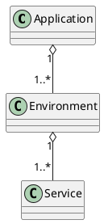

# AWS Copilotの使い方

- `AWS CLI` とは別物
- `EcS on Fargate` のサービス用のCLI

## 基本的な概念

## IAMの設定

- ローカル環境で実行する
    - `AWS Copilot CLI` のインストール
        - [公式ドキュメント](https://aws.github.io/copilot-cli/ja/)

    - `IAM User` を作成する。
    - `AWS CLI` の `Configure` で登録する。
    - `IAM User` に [AdministratorAccess](https://us-east-1.console.aws.amazon.com/iamv2/home?region=ap-northeast-1#/policies/details/arn%3Aaws%3Aiam%3A%3Aaws%3Apolicy%2FAdministratorAccess?section=policy_permissions)の権限を付与する
