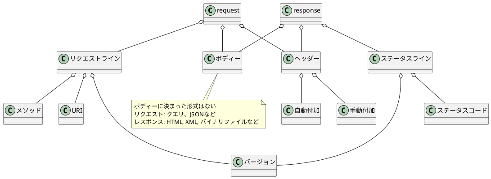

# Youtube cURLを使ったAPI連携の基礎と応用

## 学習メモ

### HTTP通信の流れ

```plantuml
@startuml
class request

request o-- リクエストライン
リクエストライン o-- メソッド
リクエストライン o-- URI
リクエストライン o-- バージョン
request o-- ヘッダー
ヘッダー o-- 自動付加
ヘッダー o-- 手動付加
request o-- ボディー

response o-- ステータスライン
ステータスライン o--- バージョン
ステータスライン o-- ステータスコード
response o-- ヘッダー
response o-- ボディー

note bottom of ボディー
ボディーに決まった形式はない
リクエスト: クエリ、JSONなど
レスポンス: HTML, XML, バイナリファイルなど
end note
@enduml
```
